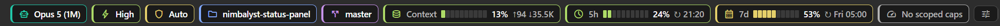

# Status Panel

*The Claude Code status line as a bottom panel.*

A Nimbalyst bottom panel that mirrors the Claude Code CLI status line (`~/.claude/statusline.ps1`) for the active Agent session, so SDK-backed sessions show the same information the terminal REPL does.




Both themes, captured at 1:1 from the running panel — dark above, light below. Nothing is scaled, so the bars are as legible as they actually are; see [Light and dark](#light-and-dark).

**Status:** installed and running in Nimbalyst, verified on screen against live Claude Code and Codex sessions. Several checks are still open — see [Verification checklist](#verification-checklist).

## Claude Code only

v1 is built for Claude Code sessions, and that is a deliberate limit rather than an oversight — per-provider behaviour is deferred. Install it expecting Claude; do not install it expecting Copilot, Cursor or Codex support.

What that means on a session from another provider:

- **Model** — the chip matches the session's model id against the whole model catalog, so a non-Claude model usually still resolves to a name. When it does not, the fallback in `src/lib/modelNames.ts` only knows `claude-code:` ids, and the raw id is shown instead.
- **5h / 7d / scoped caps** — these read Anthropic's plan-usage endpoint with your Claude OAuth token, so they report *your Claude plan* rather than the focused session. Alongside a session from another provider they now say so: the chips read `Claude 5h` rather than `5h`, drop to the muted accent instead of green/yellow/red, and their tooltip names the provider the session actually runs on (GET-103). The number is kept — your Claude plan is yours whichever session is in front of you — but the colour stops claiming urgency about a session it does not govern.
- **Effort, permission mode, directory, branch** — provider-neutral; these work the same either way.
- **Context** — comes from the session's own `metadata.tokenUsage`, so it populates for any provider that records it and reads `Context —` otherwise.

Confirmed on screen against a live `openai-codex` session (GET-89): every chip renders, the model reads as the raw `openai-codex:gpt-5.6-luna`, and the Context bar is fully populated at `15% ↑38.3K ↓35`. Nimbalyst writes `metadata.tokenUsage` with `currentContext` for Codex exactly as it does for Claude Code, so Context is not a per-provider gap — it is empty only until a session has been prompted once, which is true of any provider.

Two rough edges did show up there, and both are about *which* session the strip describes and *whose* limits it reports:

- **The strip follows the most recently updated session, not the one you are looking at.** Switching to a Codex session in the UI does not move the chips; prompting it does. `metadata.metadata.lastReadAt` is the signal that would fix this — `setActiveSessionAtom` calls `markSessionReadAtom` unconditionally on every active-session change, which persists `lastReadAt` through `ai:updateSessionMetadata` and broadcasts the `sessions:session-updated` the panel already listens for. Ranking candidates by `lastReadAt`, falling back to `updatedAt`, would track the visible session without needing the renderer atom `session:get-active` refuses to expose.
- **~~The 5h / 7d / scoped bars keep reporting the Claude plan~~** next to a session that has nothing to do with it, with no visual hint that they are unrelated. Fixed in GET-103: they are relabelled and muted, as described above. Hiding them outright was considered and rejected — the bar's presence was never the problem, its colour was.

Turning the usage chips off in the gear popover remains there if you would rather not see them at all.

## Why a panel

Nimbalyst's Agent toolbar is a fixed React component — the `Context Breakdown` chip is `data-testid="context-indicator"`, not a pluggable slot. The extension manifest offers no toolbar or status-bar contribution point. `contributions.panels` is the supported surface for custom UI, so the status line becomes a bottom panel: `Ctrl+Shift+S`, or `Ctrl+J` and pick the tab.

Trade-off to live with: the SDK documents bottom panels as "mutually exclusive with other bottom panels (terminal, tracker)" (`@nimbalyst/extension-sdk/dist/types/panel.d.ts`). A status line you want permanently visible therefore competes with the terminal for the same slot. If that proves annoying in practice, `sidebar` placement or a `floating` panel are the escape hatches.

## Segments

Rendered as a chip strip, in status-line order:

| Chip | Content |
| --- | --- |
| Model | Display name from the model catalog, falling back to the raw session model id |
| Effort | `High` etc., title-cased |
| Permission mode | `Bypass` / `Auto` / `Plan` / `Default`, color-coded as in the script |
| Directory | Repo root folder name when in a git repo, else the workspace folder |
| Branch | Current branch, with `±n` uncommitted-file count |
| Context | 10-cell bar, percentage, `↑input ↓output` counts |
| 5h / 7d | Claude plan utilization bars with reset stamps; `Claude 5h` and muted beside a non-Claude session |
| Scoped caps | Model-scoped limits from the API's `limits[]`, e.g. `7d Fable` |

Chips are centered in the strip, and a gear chip at the end opens a popover for choosing which segments appear and in what order (checkbox + up/down, with Reset). The choice is persisted through `host.storage.setGlobal`, so it follows you across workspaces rather than resetting per project. A stored config is reconciled against the current segment list on load, so segments added in a later version appear instead of silently vanishing.

### Deferred

- Clock (local + TZ abbreviation, UTC)
- Current-turn stopwatch and tool-call count
- Fast mode chip

## Decisions

1. **Session tracked** — follows the focused session. Nimbalyst keeps focus in a renderer atom extensions cannot read (`session:get-active` is a stub returning `null`), so this resolves to *the most recently updated session in the workspace*, re-queried on every session broadcast. In practice that is the session you are talking to. If it ever picks wrong, the fallback is a session picker pinned via `host.storage`.
2. **Permission mode** — the workspace value (`agentPermissionMode`), not the per-session Shift+Tab mode the script parses out of the transcript. There is no stored `auto` value: `agentPermissions.permissionMode` of `bypass-all` combined with `allowAllUsesClassifier: true` is what Nimbalyst launches as auto mode, so the panel reports that pair as `Auto` and keeps `Bypass` for `bypass-all` with the classifier off.
3. **Refresh** — event subscriptions (`sessions:session-updated`, `sessions:session-created`, `sessions:refresh-list`, `claude-usage:update`, and the `open-ai-session` window event) plus a 5 s timer for values nothing broadcasts.
4. **Layout** — horizontal chip strip, wrapping.
5. **Keybinding** — `Ctrl+Shift+S`. Verified free: Nimbalyst's `file` shortcut group has no `saveAs` entry and nothing in the app binds `Shift+S`.

## Architecture

Panels run in Nimbalyst's renderer and receive a `host` prop (`{ host }`, per `PanelContainerInner`), with `window.electronAPI` available for IPC — the same approach the bundled Git panel uses.

```
src/
  index.ts            # exports { panels, activate, deactivate }
  StatusPanel.tsx     # chip strip
  useStatus.ts        # subscriptions + 5s timer, generation-guarded
  components/Chip.tsx      # Chip + Bar
  components/ConfigChip.tsx # gear chip + segment picker popover
  segments.ts         # segment registry, default order, config reconciliation
  useSegmentConfig.ts # load/save config via host.storage global scope
  lib/ipc.ts          # typed, failure-tolerant wrapper over electronAPI
  lib/planUsage.ts    # reads the credentials file and calls the usage API directly
  lib/format.ts       # formatTokens / formatResetTime / labels, ported from the .ps1
  lib/thresholds.ts   # Night Owl palette + bar thresholds, ported from the .ps1
```

### Data sources

| Segment | Channel |
| --- | --- |
| Session | `sessions:list(workspacePath, opts)` → newest → `sessions:get(id)` |
| Model / context window | `ai:getModels()` matched on `session.model` |
| Effort | `ai:getEffectiveSettings`, falling back to `settings:get-default-effort-level` |
| Permission mode | `app-settings:get("agentPermissionMode")`, falling back to `workspace:get-state` |
| Branch / dirty | `git:is-repo`, `git:branches`, `git:get-uncommitted-files` |
| Tokens | `session.metadata.tokenUsage` |
| Plan usage | `api.anthropic.com/api/oauth/usage`, falling back to `claude-usage:get()` |

### Plan usage

`claude-usage:get` maps only `five_hour`, `seven_day`, and `seven_day_opus` — the API's `limits[]` array, which carries model-scoped caps like `7d Fable`, never reaches the renderer. Since that is the cap most likely to bite, the panel calls the usage endpoint itself.

`src/lib/planUsage.ts` reads the OAuth token from `.credentials.json`, `GET`s `https://api.anthropic.com/api/oauth/usage` with `anthropic-beta: oauth-2025-04-20`, and shapes the response the way `~/.claude/get-plan-usage.ps1` does — including `allLimits`, the diagnostic record of every entry in `limits[]`. Nothing is spawned; both files are reached through `read-global-claude-file` / `write-global-claude-file`, which resolve the Claude config directory host-side and honour `CLAUDE_CONFIG_DIR`. `permissions.filesystem` is still required, because that is what gates reading the credentials file.

`statusline.ps1` still dot-sources `get-plan-usage.ps1`, and the panel still shares `statusline-usage-cache.json` with it, so whichever renders first pays for the API call. Sharing that file means honouring its discipline in both directions:

- **60 s TTL** — a cache younger than that is returned as-is, so the panel and the status line do not double-fetch.
- **Atomic writes** — a temp file per renderer, then a rename. `write-global-claude-file` truncates before writing, so writing the cache path directly is what used to leave it at zero bytes.
- **Tolerant reads** — empty, truncated, or unparseable is treated as absent. Note the reader must `trim()` before `JSON.parse`: Windows PowerShell writes a UTF-8 BOM, which `JSON.parse` rejects outright.
- **Local timestamps** — written as `2026-09-18T17:56:57.983-04:00`, not `toISOString()`. `ConvertFrom-Json` coerces the field to a `[DateTime]`, and a trailing `Z` comes back `Kind=Utc`, which the status line's age expression re-reads as a local wall clock; the age goes negative, `-lt 60` holds, and the CLI serves that reading as fresh for hours.

Failures are quiet by design — no credentials, unreadable file, network error, 401, 429 — and fall back to the last cached reading, whose older timestamp is what makes the chips render as stale. That includes the console: the usage path reaches the host through `invokeQuiet`, so a channel the host cannot answer costs a `console.debug` rather than a `console.warn` every minute the panel is open. `claude-usage:get` remains the fallback when there is no reading at all, in which case the scoped bars are simply absent.

Formatting, thresholds, and the palette are ported verbatim so a bar that is red in the terminal is red here.

## Install

### From GitHub

Settings → Extensions → Marketplace → **Install from GitHub**, and paste:

```
https://github.com/makinkade/nimbalyst-status-panel
```

Nimbalyst resolves `/releases/latest`, downloads the `.nimext` asset and extracts it to `<user-data>/extensions/com.mkinkade.status-panel/` — where `<user-data>` is `%APPDATA%\@nimbalyst\electron` on Windows, `~/Library/Application Support/@nimbalyst/electron` on macOS and `~/.config/@nimbalyst/electron` on Linux. Re-pasting the same URL upgrades in place — there is no uninstall step.

`v0.1.3` is the published release, so this path works. Note that it needs a release and **fails rather than degrading without one**: with no release Nimbalyst falls back to cloning the source, which requires a committed `dist/`, and `dist/` is deliberately gitignored here — that fallback would report *"Extension repository does not include a built dist/ directory."* See [Releasing](#releasing) for how the asset gets there.

### From source

Requires Extension Dev Tools (Settings → Advanced). **The `extension_*` MCP tools attach at session start**, so after enabling the setting, restart Nimbalyst or start a new AI session before installing.

```
git clone https://github.com/makinkade/nimbalyst-status-panel
cd nimbalyst-status-panel
npm install
npm run build        # -> dist/index.js, dist/index.css
npm test             # cache, throttle and staleness discipline in the usage client
```

Then from a session that has the dev tools, pointing at your own clone:

```
extension_install({ path: "/absolute/path/to/nimbalyst-status-panel" })
extension_get_status({ extensionId: "com.mkinkade.status-panel" })
```

Iterate with `extension_reload({ extensionId, path })` — though a reload does not reliably remount an already-mounted panel, so restart Nimbalyst when a change does not show up.

## Releasing

```
npm run package          # clean build -> build/status-panel-<version>.nimext + .sha256
npm run package -- --no-build   # package the dist/ already on disk
```

A `.nimext` is a zip Nimbalyst extracts straight into its user-data `extensions/{id}/` directory, so `manifest.json` has to be at the **top level** of the archive rather than one directory deep. What ships:

```
manifest.json
dist/index.js
dist/index.css
screenshots/status-panel-dark.png
screenshots/status-panel-light.png
README.md
LICENSE
```

No `src/`, no `node_modules/`, and no `.js.map` — a source map inlines the full text of `src/` through `sourcesContent`, which is the one thing the marketplace review checklist asks packages not to carry. The repo is public, so debugging means building locally.

`scripts/package.mjs` builds the archive with **adm-zip**, which is the same library `extractNimext` uses to unpack it, then re-opens the result and re-runs the installer's own checks — top-level `manifest.json` that parses and has the right `id`, `manifest.main`/`manifest.styles` actually present, no entry that escapes the destination directory. A release carrying a *broken* asset is a hard install failure that does **not** fall back to the clone path, so a malformed package is worse than no package; it is worth failing in the build rather than on someone's machine.

### Published identity

Settled in GET-93 and not worth re-deciding:

- **`author`** is `Mark Kinkade` — the same name as the LICENSE copyright line. The registry and the extension card show this string verbatim, so it is the public byline; the earlier `mkinkade` was a placeholder that did not even match the GitHub owner.
- **`id`** stays `com.mkinkade.status-panel`. `checkForUpdates()` matches an install to a registry entry on id alone, so a `com.nimbalyst.*` id would invite a first-party registry build to overwrite this GitHub install on startup.
- **`minimumAppVersion` is not a manifest field.** The registry generator derives it as `manifest.apiVersion || '1.0.0'`, so `apiVersion: "1.0.0"` — already declared — is the field that decides it. It is also never enforced: nothing compares it against the running app version, and on the GitHub install path no registry entry exists at all. Treat it as advisory metadata. A real minimum-version guard would have to be a runtime check in the panel.

### Cutting a release

`.github/workflows/release.yml` runs on any `v*` tag: `npm ci`, version check, `npm test`, `npm run package`, then `gh release create` with both artifacts attached.

```
git tag v0.1.3        # must match manifest.json "version"
git push origin v0.1.3
```

**The tag and the manifest version have to agree.** The app's update check compares a release's `tag_name` against the installed manifest version, so drift there silently breaks update detection for anyone already installed. Three copies exist — the tag, `manifest.json`, and `package.json` — and both the workflow and `npm run package` refuse to proceed when they disagree, so bump all three together.

The release is published with `--latest`, because the installer asks for `/releases/latest` specifically rather than for a tag.

Note that `0.1.1` and `0.1.2` have changelog entries but no tags: both were built and version-bumped locally and never pushed, so `v0.1.3` is the first release to carry them. Nothing is lost — the installer only ever resolves `/releases/latest` — but it does mean a version bump is not a release until the tag is pushed, and the two can drift a long way apart without anything complaining.

The `.sha256` is emitted alongside for form's sake. Nothing on the GitHub path consumes it — installs from a repo URL record `checksum: ''` — but `installFromUrl` does verify a checksum when the registry supplies one, so the discipline is worth keeping.

## Marketplace readiness (backlog)

Nothing comparable exists in the registry (`extensions.nimbalyst.com`) — 27 built-ins plus Astro, Electronics Studio, Jupyter, Mindmap, Namenym, Replicad and Slides, none of which surface session state. Publishing would mean closing these gaps, all of which exist because this was built for one machine:

1. **~~Cross-platform usage fetch.~~** Done — nothing is exec'd, so there is no command left to make portable.
2. **~~Stop depending on `~/.claude/get-plan-usage.ps1`.~~** Done — the logic is in `src/lib/planUsage.ts`. One caveat remains: on macOS the host prefers the Keychain for the OAuth token and only falls back to `.credentials.json`, and the renderer cannot reach the Keychain, so a Keychain-only login degrades to `claude-usage:get`.
3. **~~Harden the database dependency.~~** Done — `nimbalyst-database-read` and the raw SQL against `ai_sessions` are both gone. The panel resolves its session through `sessions:list` + `sessions:get`, so the only permission left is `filesystem` and nothing is coupled to an internal schema.
4. **Non-Claude providers.** Still Claude-first, but no longer silently misleading — see [Claude Code only](#claude-code-only) and the marketplace `longDescription`. ~~Still to decide: hide the irrelevant chips or show honest placeholders.~~ Decided in GET-103, for honest placeholders: beside a session whose provider is not `claude-code`, the plan chips relabel to `Claude 5h` / `Claude 7d` / `Claude 7d Fable`, render in the muted accent rather than green/yellow/red, and name the session's actual provider in their tooltip. `src/lib/provider.ts` resolves the provider from `session.provider`, falling back to the `provider:` prefix of the model id; a provider it cannot determine leaves the chips alone, so only a positive non-Claude signal demotes them. What stays genuinely provider-specific is the Model chip's name fallback, and the fact that no other provider's quota is reported at all.
5. **Packaging.** ~~Add the `marketplace` block~~ Done — `categories`, `tags`, `icon`, `tagline`, `longDescription`, `highlights` and `changelog` are populated, shaped against `ExtensionMarketplaceMetadata` in `@nimbalyst/extension-sdk/dist/types/extension.d.ts` rather than guessed from `resources/extensions/git/manifest.json`. `tagline`, `longDescription` and `highlights` are the copy shared with this README. ~~A license~~ is done too — MIT, in [LICENSE](LICENSE) (GET-91); `ExtensionMarketplaceMetadata` has no license field, so `package.json` carries it as `"license": "MIT"`. ~~`repositoryUrl`~~ is set too, now that the repo is public. ~~Delivery~~ is done too — `npm run package` produces a verified `.nimext` and a tag push publishes it (GET-100); see [Releasing](#releasing). ~~Version and author identity~~ are done too (GET-93) — see [Published identity](#published-identity). ~~`screenshots`~~ are done too (GET-94) — `screenshots/status-panel-dark.png` and `-light.png`, wired as one entry's `src` and `srcLight`. An external extension must bundle real PNGs: `fileToOpen`/`selector` drive the internal capture pipeline only, and the registry's own `extensions.nimbalyst.com/screenshots/<id>/` is an R2 bucket nobody outside Nimbalyst can write to. `screenshots/` was already in the packaging script's file list, so the PNGs ship with the `.nimext` as well as heading this README.

Publishing route is settled: **the registry is first-party only.** Every live entry is authored by Nimbalyst under `com.nimbalyst.*`, and `registry.json` is a generated artifact pushed to Nimbalyst's own R2 bucket rather than a file anyone can PR — being listed means a maintainer adds a local path to `packages/marketplace/release-extensions.txt`, which is a favour rather than a process. The docs' offer to "publish an extension you built yourself" has no workflow behind it.

The supported route is the app's own **Install from GitHub**: a public repo whose tagged releases carry a `.nimext` asset, which is what [Install](#install) documents. The `marketplace` block stays in `manifest.json` either way — the registry generator reads it straight from the manifest, so nothing needs redoing if the route ever opens. (The `marketplace.json` constant in the app bundle points at `anthropics/claude-plugins-official` — that is Claude plugins, a different system.)

## Light and dark

`src/lib/thresholds.ts` keeps the Night Owl palette literal — the point of the port is that a bar which is red in the terminal is red here — and the panel draws it over whatever surface the host theme provides. Those two facts have already collided once: the stale/unavailable bar used `PALETTE.light` (`#d6deeb`), which is Night Owl's *foreground*, meant to sit on dark navy. On a light theme a full bar in it was indistinguishable from an empty one. That path is now `MUTED`, i.e. `var(--nim-text-muted)`, which follows the theme instead of fighting it.

The two captures above are the standing check. They are the same session 23 seconds apart with nothing changed but the theme, so a fill that vanishes on one surface shows up as a difference between two images rather than as a bug report.

What they actually cover is the green and yellow thresholds on a populated session — Context at 13 %, 5h at 24 %, 7d at 53 % — and the `No scoped caps` empty state. Two things they do not: the red band above 70/80 %, and the `MUTED` rendering itself, which needs either a stale reading or a non-Claude session to appear. Those are covered by tests (`src/StatusPanel.test.tsx`) and, for the non-Claude case, by an on-screen check in GET-103; they are not in these PNGs. Re-capture when a threshold colour changes.

Cropped to the panel's own bounds. The window around it is not the subject, and a full-window capture would date itself against every unrelated change to the rest of the app.

## Verification checklist

Nothing below has been exercised against a running instance yet.

- [ ] Panel appears in the bottom panel and under `Ctrl+Shift+S`
- [ ] Model, effort, permission mode, directory, branch populate
- [ ] Context bar tracks a live session (the one source not yet confirmed — if `metadata.tokenUsage` lags, fall back to parsing the session JSONL as the script does)
- [ ] Usage bars show plausible percentages and reset stamps, including the scoped `7d Fable` bar
- [x] Usage endpoint reachable from the renderer, credentials read, cache written atomically and read back by `Get-PlanUsage`
- [x] `statusline.ps1` still renders correctly after the extraction
- [x] Light and dark themes both legible — captured at 1:1 on both surfaces, green and yellow thresholds plus the `No scoped caps` empty state (GET-94); see [Light and dark](#light-and-dark) for what those two images do *not* cover
- [ ] Empty states: no session, not a git repo, usage unavailable offline
- [x] The plan chips degrade to `Claude 5h` in the muted accent beside a non-Claude session, keeping the number and dropping the urgency colour (GET-103) — `src/StatusPanel.test.tsx`, `src/lib/provider.test.ts`
- [x] The same degradation seen on screen in the running panel after a restart (GET-103)
- [x] A session from another provider renders every segment rather than throwing — `src/StatusPanel.test.tsx` builds the strip from the record Nimbalyst wrote for a real `openai-codex` session (GET-89)
- [x] The same strip seen on screen in the running panel, with a `gpt-5.6-luna` Codex session resolved (GET-89)
- [x] `npm run package` produces an archive whose top-level `manifest.json` parses under an independent zip reader, with no `src/` or source maps in it
- [x] `v0.1.3` published by the release workflow, and the app's own resolve-download-extract path replayed against it: `/releases/latest` returns the tag, `selectReleaseAsset` picks the `.nimext`, it extracts with `manifest.json` on top and `dist/` where the manifest points, both `screenshots/` PNGs are present at the sizes the manifest points to, and the published `.sha256` matches the published asset
- [ ] The same thing on a *clean* machine, through the real UI rather than a replay of its logic — Windows (GET-95) and macOS/Linux (GET-96)

## License

MIT — see [LICENSE](LICENSE). Copyright (c) 2026 Mark Kinkade.

`ExtensionMarketplaceMetadata` has no license field (`@nimbalyst/extension-sdk/dist/types/extension.d.ts`), so `package.json` carries `"license": "MIT"` as the machine-readable copy and the registry entry has nowhere to state it.

Nothing third-party is redistributed in `dist/`: `react`, `react-dom` and the SDK are all externalized by `createExtensionConfig`, so the built bundle imports them from the host rather than inlining them. Their own licenses are MIT in any case, so nothing here conflicts.
